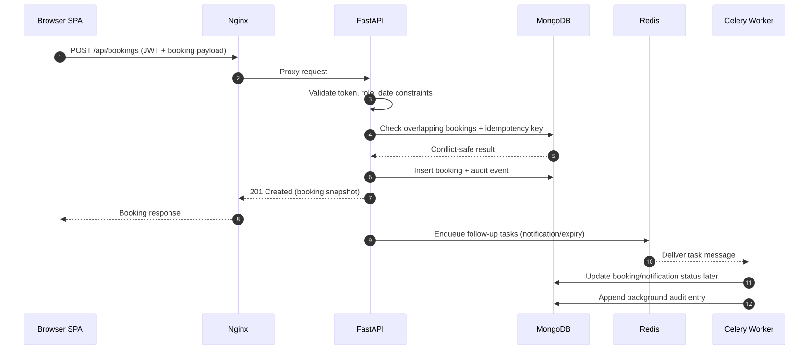
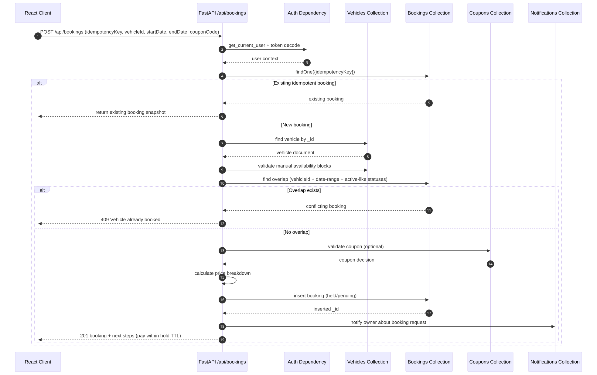

# Car Rental System - Comprehensive Technical Report

**Author:** Harshvardhan  
**Audience:** Computer Science Students (University Peers)  
**Status:** Initialized - Ready for Section-wise Expansion

---

## Section 1: Project Introduction and High-Level Architecture

### 1.1 A Welcome Note from Harshvardhan

Hi everyone, I am Harshvardhan, and this project is my attempt to answer a question that looks simple on paper but becomes surprisingly complex in real software systems:

How do we build a car rental platform that feels instant and easy for users, while still handling real-world business constraints like availability conflicts, payment reliability, role-based permissions, and lifecycle automation?

I did not want to build a "toy CRUD app" where a user clicks a button and data is inserted into a database with no operational realism. I wanted to build something that behaves like an actual production-grade system:

- Multiple personas: renter, owner, and admin.
- Booking lifecycle with transitions and guardrails.
- Search and filtering that scale beyond static mock data.
- Payment and hold semantics (reserve now, confirm later).
- Async background operations for time-driven transitions.
- Deployment shape that mirrors modern full-stack systems.

If I had to summarize the philosophy in one sentence:

This platform is intentionally designed to demonstrate how distributed application concerns emerge from everyday product features.

When we discuss architecture in class, we often draw neat boxes and arrows. This project tries to make those arrows "real" by connecting user actions (frontend), routing (Nginx), application logic (FastAPI), persistence (MongoDB), and asynchronous processing (Redis/Celery-style workers).

Think of this platform like an airport operations system:

- Frontend is the passenger terminal interface.
- Nginx is air traffic control routing requests to the right runway.
- FastAPI is the operations center making policy decisions.
- MongoDB is the official record ledger.
- Redis + Celery workers are the ground crew handling delayed and parallel jobs.

The airport analogy is useful because it highlights a key truth: not every operation should happen in the critical path of user interaction. Some must happen immediately (identity verification, booking validation), while others are better delegated to asynchronous workflows (expiry jobs, notifications, archival).

---

### 1.2 Motivation: Why Build a Modern Car Rental Platform?

Traditional rental workflows in many small-scale systems are still surprisingly manual:

- Calls/DMs for vehicle checks.
- Spreadsheet-based booking ledgers.
- Human-driven overlap checks (error-prone).
- Manual invoice/payment reconciliation.
- Delayed owner updates and poor customer transparency.

From a software engineering perspective, these workflows are not just inconvenient. They are algorithmically fragile. As demand grows, manual coordination scales roughly like $O(n^2)$ in cognitive overhead because each new booking must be cross-verified against many existing decisions and side effects.

This project introduces a platform mindset where:

1. System constraints become code-level contracts.
2. Data consistency is enforced at write time, not by post-hoc cleanup.
3. Time-sensitive states are automated by background processes.
4. User experience remains responsive through asynchronous decomposition.

In short, the goal is to convert operational chaos into deterministic flows.

---

### 1.3 Core Problems Solved by the Platform

#### 1.3.1 Manual Booking Overhead

**Problem:** Human operators must repeatedly answer "Is this vehicle available from X to Y?" and then maintain status manually.

**Solution in this architecture:**

- Query-time filtering for vehicle discovery.
- Server-side overlap validation in booking APIs.
- Booking state machine to encode legal transitions.
- Background state transitions for time-driven changes.

This turns booking management from free-form text communication into a controlled state-transition system.

#### 1.3.2 Payment Tracking and Idempotency

**Problem:** Duplicate checkout retries can trigger duplicate records or inconsistent states if requests are replayed.

**Solution in this architecture:**

- Idempotency keys indexed uniquely at the bookings layer.
- Payments linked by booking identity and status transitions.
- Audit logging for sensitive operations.

From a distributed systems lens, idempotency is a guard against network uncertainty. If a client retries due to timeout, the backend should converge to one logical operation, not multiple side effects.

#### 1.3.3 Vehicle Availability and Double-Booking Prevention

**Problem:** Concurrent requests can race and reserve the same vehicle if availability checks are naive.

**Solution in this architecture:**

- Atomic validation patterns around booking writes.
- Composite indexes on booking interval dimensions.
- Hold semantics with expiration windows.

This architecture treats availability as a consistency domain, not a UI suggestion.

#### 1.3.4 Operational Latency vs User Experience

**Problem:** If every operation is synchronous, user response time degrades and critical endpoints become overloaded.

**Solution in this architecture:**

- FastAPI handles user-critical reads/writes quickly.
- Background tasks handle non-immediate flows.
- Redis-backed queue model (Celery-compatible) supports scale-out workers.

The result is better perceived performance and better system throughput.

#### 1.3.5 Multi-Role Governance

**Problem:** Owners, renters, and admins require different visibility and permissions.

**Solution in this architecture:**

- JWT-backed auth and role checks.
- Route-level access control.
- Admin moderation and analytics views.

Access control is enforced server-side rather than trusted to frontend checks.

---

### 1.4 High-Level Product Capabilities (System as a Set of Contracts)

At a product level, this platform supports:

- Vehicle onboarding and moderation.
- Search, filtering, and detail exploration.
- Booking creation with temporal constraints.
- Hold-based payment flow.
- Booking status transitions: draft/pending/held/confirmed/active/completed/archived with cancellation/refund branches.
- User/owner/admin dashboards.
- Notifications and audit traceability.

At an architecture level, each capability is expressed as one or more contracts:

- API contract (request/response + validation).
- Data contract (document schema + indexes).
- Temporal contract (TTL/expiry/scheduled transitions).
- Security contract (authn/authz boundaries).

This dual view (feature + contract) is what makes the platform teachable and maintainable.

---

### 1.5 Detailed Tech Stack Breakdown and Why These Choices Were Made

This section does not just list tools; it explains decision criteria and alternatives.

#### 1.5.1 Backend: FastAPI (Python)

**Why FastAPI was chosen:**

- Native async support maps well to high-concurrency I/O workloads.
- Pydantic models provide strong data validation and serialization.
- Automatic OpenAPI docs improve team velocity and debugging.
- Clean dependency injection for auth and role checks.

**Why not Flask (for this architecture):**

- Flask is flexible and mature, but FastAPI provides stronger typed-request ergonomics out of the box for API-first development.

**Why not Django (for this architecture):**

- Django is excellent for full-stack monoliths, but this project is API-centric with a decoupled React client and async-heavy behavior.

**Engineering benefit:**

FastAPI lets the backend behave like a policy engine: validate aggressively, fail fast, and surface precise contracts.

#### 1.5.2 Database: MongoDB with Motor (Async Driver)

**Why MongoDB was chosen:**

- Flexible document structure suits evolving feature sets.
- Good fit for nested payloads (vehicle metadata, booking context, notifications).
- Index strategy can still enforce strong practical constraints.

**Why Motor:**

- Async MongoDB client aligns with FastAPI async endpoints.
- Avoids blocking calls that would reduce concurrency efficiency.

**Why not PostgreSQL (in this iteration):**

- PostgreSQL would be a strong choice for relationally strict domains.
- For this project phase, schema flexibility and rapid iteration on domain entities were prioritized.

**Important design point:**

Using MongoDB does not mean abandoning rigor. Indexes, unique keys, and server-side validations still encode invariants.

#### 1.5.3 Frontend: React + Vite + TypeScript + Tailwind CSS

**Why React:**

- Component-driven architecture for complex dashboard and form flows.
- Ecosystem maturity and routing/state tooling.

**Why Vite:**

- Fast dev server startup and HMR.
- Lean build pipeline for modern modules.

**Why TypeScript:**

- Strong compile-time contracts between UI and API payloads.
- Reduced runtime class of bugs in forms, filters, dashboard data handling.

**Why Tailwind CSS:**

- Fast, utility-first styling for consistency.
- Good for large UI surfaces with many repeated layout patterns.

**State management note:**

- Zustand/Context patterns keep state local where possible and global where necessary (auth/session/dashboard states).

#### 1.5.4 Asynchronous Processing: Redis + Celery Worker Pattern

**Why this matters conceptually:**

Not every task belongs in an HTTP request lifecycle. Some work should be queued and executed separately.

**Why Redis:**

- Low-latency in-memory broker/cache role.
- Widely used with Celery.
- Operationally simple for local/distributed deployments.

**Why Celery pattern:**

- Standard Python distributed task queue model.
- Enables horizontal scaling with dedicated workers.
- Supports retries, scheduling, queue isolation per task class.

**Current implementation note (important for peers):**

In this repository, periodic background transitions are currently executed via an in-process async task loop in backend startup flow. However, the architecture is intentionally Redis/Celery-ready, and dependencies/environment are aligned for worker-based decoupling.

This is a great teaching point:

- Stage 1: In-process scheduler for simplicity.
- Stage 2: External workers for resilience and scale.

Same domain behavior, different deployment topology.

#### 1.5.5 Infrastructure: Docker, Docker Compose, Nginx

**Why Docker Compose:**

- Reproducible multi-service local environment.
- Explicit service topology (frontend, backend, MongoDB, Redis).

**Why Nginx in frontend container:**

- Serves compiled SPA efficiently.
- Proxies /api and /uploads traffic to backend.
- Handles static caching and gzip for better delivery.

**Why this infra layout works well educationally:**

It mirrors real deployment concerns without requiring cloud complexity at the learning stage.

---

### 1.6 Complex System Architecture Diagram (Mermaid)



---

### 1.7 Detailed Explanation of the Diagram

This section walks left-to-right through the architecture.

#### 1.7.1 Client Zone: Where Intent Begins

The browser hosts a React + TypeScript single-page application (SPA).

Key responsibilities:

- Render role-specific UI surfaces (renter/owner/admin).
- Collect user input and transform it into API payloads.
- Attach JWT token for authenticated requests.
- Handle optimistic user feedback and eventual backend truth.

Analogy: the SPA is a cockpit dashboard. It should show controls and telemetry, but it should not pretend to be the engine room.

#### 1.7.2 Edge Zone (Nginx): Routing and Delivery Discipline

Nginx serves two categories of traffic:

1. Static artifacts: HTML/CSS/JS/image/font bundles.
2. Reverse-proxied API and upload traffic toward backend.

From the frontend Nginx configuration, the essential behavior is:

- Fallback to index.html for client-side routing.
- Proxy /api/* to backend:8000/api/*.
- Proxy /uploads/* to backend uploads endpoint.
- Cache static immutable assets.
- Enable gzip compression.

Analogy: Nginx is a traffic dispatcher with lane separation. Cars carrying passengers (static assets) and cargo trucks (API calls) use different handling rules.

#### 1.7.3 Application Zone (FastAPI): The Policy Brain

FastAPI is where domain rules are enforced.

Primary concerns implemented here:

- Authentication and authorization boundaries.
- Business invariants (state transitions, ownership checks).
- Input validation and schema normalization.
- Rate limiting and request governance.
- Route modularization by domain.

A simplified, commented representation of startup responsibilities:

```python
# FastAPI startup lifecycle (conceptual excerpt)
# 1) Build indexes for query speed and constraint support.
# 2) Start periodic background maintenance loop.
# 3) Ensure upload directory exists.
@asynccontextmanager
async def lifespan(app: FastAPI):
		await init_indexes()                    # Data contracts become enforceable.
		task = asyncio.create_task(run_background_tasks())  # Time-based domain logic.
		os.makedirs(settings.UPLOAD_DIR, exist_ok=True)
		yield
		task.cancel()                           # Graceful shutdown behavior.
		await close_db()
```

This lifecycle design ensures the API process starts in a ready state with indexes and maintenance workers active.

#### 1.7.4 Data Zone (MongoDB): Source of Persistent Truth

MongoDB stores all durable platform state:

- Identity: users.
- Inventory: vehicles.
- Transactions: bookings and payments.
- Communication: notifications.
- Governance: audit logs and configs.

Important index-driven patterns in this project:

- Unique index on user email.
- Unique idempotency key for booking deduplication.
- Compound booking indexes for interval queries and filtering.
- Auxiliary indexes for notification lookup and admin analytics.

The practical lesson: in document databases, performance and correctness still depend on explicit index strategy.

#### 1.7.5 Queue Zone (Redis) and Worker Zone (Celery Pattern)

Redis acts as low-latency queue infrastructure for asynchronous tasks.

The Celery pattern introduces:

- Producer side: API emits task messages instead of doing heavy work inline.
- Consumer side: workers process tasks independently.
- Scheduler side (Celery Beat): periodic jobs are published at fixed intervals.

Typical responsibilities delegated to workers:

- Expire booking holds.
- Trigger status transitions around start/end time.
- Send non-critical notifications.
- Post-process analytics snapshots.

Why this decomposition matters:

- HTTP latency remains low for end-users.
- Workers scale separately from API pods/instances.
- Failure domains are isolated (temporary worker failure does not crash API route handlers).

#### 1.7.6 Current vs Target Async Topology

Current implementation in this repository:

- Time-based maintenance runs via in-process async loop (run every minute).

Target/scale topology (already represented in architecture and dependencies):

- Move periodic and heavy tasks to external Celery workers using Redis broker.

This transition is mostly infrastructural, not conceptual. Domain logic remains same; execution environment changes.

---

### 1.8 End-to-End Request and Data Flow (Narrative Walkthrough)

Let us trace a booking journey:

1. User selects dates and vehicle in SPA.
2. SPA calls API endpoint through Nginx proxy.
3. FastAPI validates JWT, role, payload, and date constraints.
4. FastAPI checks booking conflicts and idempotency.
5. Booking is written to MongoDB with initial state (for example, held/pending).
6. Response returns quickly with booking reference.
7. Async layer (current scheduler or Celery workers) handles delayed transitions.
8. Notifications and audit records are persisted.
9. Dashboards query fresh state and render owner/admin insights.

Sequence view:



Educational insight: user-facing success response does not require all downstream work to finish immediately. This is one of the most important principles in scalable web systems.

---

### 1.9 Architecture Trade-Offs and Design Rationale

Every architecture is a set of trade-offs.

#### Trade-off 1: Simplicity vs Scalability

- In-process background loop is simpler to run initially.
- External Celery workers are more scalable and fault-isolated.

Decision: start simple, keep queue-compatible boundaries for later scale-out.

#### Trade-off 2: Flexible Documents vs Strict Relational Schema

- MongoDB accelerates iteration for evolving entities.
- Requires disciplined index and validation strategy.

Decision: use MongoDB + strong API validation + indexes.

#### Trade-off 3: Rich Frontend UX vs State Complexity

- React dashboards and role-based flows improve usability.
- More local and shared state requires thoughtful structure.

Decision: TypeScript contracts + scoped global state (Zustand/Context) to reduce accidental complexity.

#### Trade-off 4: Immediate Completeness vs Deferred Processing

- Synchronous all-in-one processing gives immediate certainty but higher latency.
- Async task offload improves responsiveness but introduces eventual consistency windows.

Decision: prioritize user responsiveness while making eventual updates visible via notifications and dashboard refresh flows.

---

### 1.10 Why This Architecture Is a Strong Learning Artifact for CS Peers

This project is educationally valuable because it demonstrates multiple core software engineering concepts in one cohesive product:

- API contract design with typed validation.
- Async I/O and concurrency in backend services.
- Index-aware NoSQL data modeling.
- Stateful workflow modeling (booking lifecycle).
- Authentication/authorization as enforceable boundaries.
- Reverse proxying and multi-service container orchestration.
- Separation between request path and background path.

It is not just "full-stack" in the UI + API sense; it is full-stack in the systems sense.

That distinction matters. Many projects stop at screens and endpoints. This one extends into deployment topology, background execution, reliability boundaries, and lifecycle automation.

---

### 1.11 Appendix-Like Technical Snippets for Section 1

#### 1.11.1 Service Topology (Docker Compose, Commented)

```yaml
# Core topology: 4 containers + persistent volumes.
services:
	mongodb:
		image: mongo:7
		# Durable storage for platform records.

	redis:
		image: redis:7-alpine
		# Queue/broker layer for asynchronous jobs.

	backend:
		build: ./backend
		depends_on:
			mongodb:
				condition: service_healthy
			redis:
				condition: service_healthy
		# FastAPI service with DB + queue connectivity.

	frontend:
		build: ./frontend
		depends_on:
			- backend
		# Nginx serves SPA and proxies /api + /uploads.
```

#### 1.11.2 Nginx API Reverse Proxy Pattern (Commented)

```nginx
# Requests under /api/ are forwarded to backend service.
location /api/ {
		proxy_pass http://backend:8000/api/;
		proxy_set_header Host $host;
		proxy_set_header X-Real-IP $remote_addr;
		proxy_set_header X-Forwarded-For $proxy_add_x_forwarded_for;
		proxy_set_header X-Forwarded-Proto $scheme;
}

# Uploads are also proxied so frontend keeps one origin path model.
location /uploads/ {
		proxy_pass http://backend:8000/uploads/;
		proxy_set_header Host $host;
}
```

#### 1.11.3 In-Process Background Task Loop (Current Runtime)

```python
async def run_background_tasks():
		while True:
				try:
						# Domain maintenance routines.
						expired = await expire_holds()
						activated = await activate_bookings()
						completed = await complete_bookings()

						# Optional signal for observability.
						if expired or activated or completed:
								print(f"[Tasks] Expired={expired}, Activated={activated}, Completed={completed}")
				except Exception as e:
						print(f"[Tasks] Error: {e}")

				# Runs periodically; candidate for Celery beat migration.
				await asyncio.sleep(60)
```

---

### 1.12 Section 1 Summary

Section 1 established the architectural intent behind the Car Rental System:

- Build a production-like platform, not a demo-only CRUD application.
- Solve real operational bottlenecks around booking conflicts, payment tracking, and state transitions.
- Use FastAPI + MongoDB + React as a high-velocity and robust full-stack foundation.
- Introduce Redis/Celery worker architecture for scalable asynchronous workflows.
- Keep the system educational by exposing clear boundaries between client, edge, API, data, and worker layers.

In the next sections, this high-level blueprint will be unfolded into deeper implementation details: domain models, routing logic, booking state machine enforcement, pricing engine behavior, security controls, and deployment/testing practices.

---

## Section 2: Database Design and Data Modeling with MongoDB

### 2.1 Why MongoDB for a Domain That Looks Relational?

At first glance, a car-rental platform appears to be classically relational:

- One user can own many vehicles.
- One user can make many bookings.
- One vehicle can have many bookings and reviews.
- One booking can have multiple payment records (charge + refund records).
- Coupons are applied across many bookings.

In a textbook RDBMS framing, this naturally maps to normalized tables and foreign keys.

So why choose MongoDB?

The answer is not "because NoSQL is modern". The answer is workload shape and evolution velocity.

#### 2.1.1 Product Evolution Was a First-Class Constraint

This system has rapidly evolving entities with optional and nested structures:

- Vehicle specs evolve (fuel, seats, peak season ranges, nested pricing).
- User profiles evolve (verification, emergency contacts, referral metadata).
- Booking behavior evolves (hold windows, dispute notes, policy snapshots).
- Coupon rules evolve (first-time-only, usage maps, caps, expiries).

In relational systems, each model mutation often implies schema migration overhead and migration risk management. That is manageable, but it slows iteration. MongoDB lets the project evolve feature surfaces quickly while still imposing discipline through:

- API-layer strict validation (Pydantic).
- Strong indexing and uniqueness constraints.
- Controlled write paths in route handlers.

#### 2.1.2 Hybrid Modeling Strategy: Document-Centric, Relation-Aware

A common misconception is that NoSQL means "no relationships". In practice, this project follows a hybrid approach:

- Store core entities as separate collections (users, vehicles, bookings, payments, reviews, coupons).
- Link by identifier references (ObjectId or string-form IDs depending on collection conventions).
- Avoid over-embedding high-churn relational data that needs independent lifecycle.

This is essentially relational thinking implemented with application-enforced referential semantics.

#### 2.1.3 Query Pattern Alignment

Most critical reads in this app are entity-centric:

- "Get this vehicle with details and availability context"
- "Get this user's bookings"
- "List bookings by status and recency"
- "Find coupon by code"
- "Find payments by booking"

MongoDB handles these patterns efficiently when indexes are aligned with filters/sorts. This project does exactly that, especially around booking conflict checks and idempotent operations.

#### 2.1.4 Practical Decision Rule

For this implementation stage:

- MongoDB + Pydantic + index strategy provided high delivery speed.
- Application layer retained control over relational integrity semantics.
- Future migration to stricter relational storage remains possible if business constraints demand it.

Think of it this way: MongoDB is used here as a flexible storage substrate, while FastAPI + Pydantic behaves like the schema governance layer.

---

### 2.2 Core Collections Overview (Users, Vehicles, Bookings, Reviews, Coupons, Payments)

This section explains each core collection not only by fields, but by role in system invariants.

#### 2.2.1 Users Collection

Collection: users

Purpose:

- Identity, authentication context, and platform role.
- User-level governance flags (verification, blacklisting).
- Referral and profile metadata.

Important characteristics:

- Unique email index enforces one account per email.
- Password is stored as passwordHash (never plaintext).
- Role is one of user, owner, admin.

Design nuance:

Users serve as principals across multiple domains, so user IDs are propagated into bookings, reviews, referrals, and notifications.

#### 2.2.2 Vehicles Collection

Collection: vehicles

Purpose:

- Inventory owned by owners.
- Searchable specs and pricing definitions.
- Booking policy controls (instant booking, cancellation policy, approval mode).

Important characteristics:

- Owner relationship via ownerId.
- Embedded nested documents for specs and pricing.
- Availability blocks for maintenance/manual blackout windows.

Design nuance:

Vehicle documents intentionally embed stable descriptive data (title, specs, pricing config) but avoid embedding bookings. Bookings are high-churn and independently queryable, so they remain separate.

#### 2.2.3 Bookings Collection

Collection: bookings

Purpose:

- Transactional core of the platform.
- Encodes booking lifecycle and temporal boundaries.
- Stores pricing snapshot used for financial integrity.

Important characteristics:

- idempotencyKey (unique) prevents duplicate logical booking creation.
- vehicleId + startDate + endDate queried for conflict detection.
- status drives state machine transitions.
- holdExpiresAt supports hold-to-cancel workflow.

Design nuance:

Bookings are treated as immutable-history-friendly transactional records with state transitions, rather than mutable draft objects that can be rewritten arbitrarily.

#### 2.2.4 Reviews Collection

Collection: reviews

Purpose:

- Capture renter feedback per completed booking.
- Support rating aggregation and credibility constraints.

Important characteristics:

- One booking-user pair should create at most one review (enforced in route logic by pre-check).
- Ratings are bounded by validation rules.

Design nuance:

Reviews are linked to both bookingId and vehicleId. bookingId linkage preserves "provenance" so reviews can only originate from legitimate completed bookings.

#### 2.2.5 Coupons Collection

Collection: coupons

Purpose:

- Promotional rule engine storage.
- Holds constraints such as expiry, usage caps, per-user limits.

Important characteristics:

- code is unique and normalized uppercase.
- isActive controls lifecycle without hard deletion.
- userUsage map tracks per-user usage counts.

Design nuance:

Coupon documents model both static rule definition and dynamic usage counters, making this collection a mini-policy engine.

#### 2.2.6 Payments Collection

Collection: payments

Purpose:

- Record financial transaction attempts and outcomes.
- Preserve charge/refund traceability over time.

Important characteristics:

- bookingId links payment records to booking lifecycle.
- status tracks pending/succeeded/failed/refunded.
- refunds are represented as separate negative amount records.

Design nuance:

Representing refund as an additional record (rather than mutating one row only) keeps a ledger-like transaction history, which is audit-friendly.

---

### 2.3 Massive ER Diagram (MongoDB Logical Relationships)



#### 2.3.1 ER Diagram Interpretation Notes

- MongoDB does not enforce foreign keys at database-engine level.
- Relationships above are logical/application-enforced.
- FK markers in the diagram denote reference intent and route-level validation behavior.
- This diagram intentionally combines strict core collections with governance collections (notifications, audit_logs, referrals) to show real system coupling.

---

### 2.4 Sample JSON Documents for Core Collections

The following documents are realistic examples based on route-layer writes.

#### 2.4.1 users Sample Document

```json
{
	"_id": "65f3b7e97f0f2fd613b57a01",
	"name": "Harshvardhan",
	"email": "harshvardhan@example.com",
	"passwordHash": "$2b$12$NQm6f8...",
	"role": "owner",
	"verified": false,
	"isVerified": false,
	"isBlacklisted": false,
	"referralCode": "m8Q_jt2A3k",
	"referralCount": 2,
	"referredBy": null,
	"emergencyContact": {
		"name": "Aarav",
		"phone": "+91-9876543210",
		"relation": "Brother"
	},
	"profile": {
		"phone": "+91-9000000001",
		"address": "Pune, Maharashtra"
	},
	"createdAt": "2026-03-01T10:15:30Z",
	"updatedAt": "2026-03-15T08:20:10Z"
}
```

#### 2.4.2 vehicles Sample Document

```json
{
	"_id": "65f3b8b47f0f2fd613b57a12",
	"ownerId": "65f3b7e97f0f2fd613b57a01",
	"title": "Hyundai Creta SX",
	"description": "Well-maintained SUV with Android Auto and rear camera.",
	"images": [
		{ "url": "/uploads/65f3b8b47f0f2fd613b57a12/front.webp", "isPrimary": true },
		{ "url": "/uploads/65f3b8b47f0f2fd613b57a12/interior.webp", "isPrimary": false }
	],
	"specs": {
		"seats": 5,
		"transmission": "auto",
		"fuel": "diesel",
		"make": "Hyundai",
		"model": "Creta",
		"year": 2022,
		"color": "White",
		"mileage": 17.6
	},
	"pricing": {
		"currency": "INR",
		"baseRate": 3200,
		"weekendRate": 3700,
		"peakSeasonRate": 4200,
		"minimumDays": 1,
		"discounts": { "weekly": 0.1, "monthly": 0.18 },
		"cleaningFee": 350,
		"securityDeposit": 5000,
		"lateFeePerHour": 250
	},
	"status": "active",
	"location": "Pune",
	"geoLocation": {
		"lat": 18.5204,
		"lng": 73.8567,
		"address": "Shivajinagar, Pune"
	},
	"approvalMode": "auto",
	"instantBooking": true,
	"cancellationPolicy": "moderate",
	"peakSeasonRanges": [
		{ "start": "12-15", "end": "01-15", "label": "Year-End Holidays" }
	],
	"availability": [
		{
			"start": "2026-04-10T00:00:00Z",
			"end": "2026-04-12T00:00:00Z",
			"type": "maintenance"
		}
	],
	"avgRating": 4.7,
	"totalRatings": 38,
	"totalBookings": 52,
	"ownerVerified": false,
	"insuranceVerified": false,
	"createdAt": "2026-03-02T09:10:11Z",
	"updatedAt": "2026-03-20T17:00:00Z"
}
```

#### 2.4.3 bookings Sample Document

```json
{
	"_id": "65f3bbd07f0f2fd613b57a61",
	"vehicleId": "65f3b8b47f0f2fd613b57a12",
	"userId": "65f3c0f97f0f2fd613b57af2",
	"ownerId": "65f3b7e97f0f2fd613b57a01",
	"startDate": "2026-04-20T06:00:00Z",
	"endDate": "2026-04-23T06:00:00Z",
	"days": 3,
	"priceBreakdown": {
		"days": 3,
		"base": 9600,
		"fees": [
			{ "name": "Cleaning Fee", "amount": 350 },
			{ "name": "Security Deposit", "amount": 5000 },
			{ "name": "Service Fee", "amount": 480 }
		],
		"tax": 1872,
		"couponDiscount": 500,
		"couponCode": "WELCOME50",
		"total": 16802
	},
	"status": "held",
	"holdExpiresAt": "2026-03-25T14:30:00Z",
	"idempotencyKey": "ui-1738128212-9f65a",
	"paymentMethod": "mock_card",
	"couponCode": "WELCOME50",
	"cancellationPolicy": "moderate",
	"lateReturnFee": 0,
	"cancelReason": null,
	"refundAmount": null,
	"createdAt": "2026-03-25T14:15:00Z",
	"updatedAt": "2026-03-25T14:15:00Z"
}
```

#### 2.4.4 reviews Sample Document

```json
{
	"_id": "65f3c4e67f0f2fd613b57b90",
	"bookingId": "65f3bbd07f0f2fd613b57a61",
	"vehicleId": "65f3b8b47f0f2fd613b57a12",
	"userId": "65f3c0f97f0f2fd613b57af2",
	"rating": 5,
	"comment": "Smooth pickup, clean interior, and responsive owner.",
	"createdAt": "2026-04-24T10:45:00Z"
}
```

#### 2.4.5 coupons Sample Document

```json
{
	"_id": "65f3c8cc7f0f2fd613b57bf2",
	"code": "WELCOME50",
	"type": "fixed",
	"value": 500,
	"minBookingAmount": 3000,
	"maxDiscount": 500,
	"expiresAt": "2026-12-31T23:59:59Z",
	"usageLimit": 1000,
	"usedCount": 214,
	"perUserLimit": 1,
	"description": "Flat Rs.500 off for new users.",
	"forFirstTimeOnly": true,
	"isActive": true,
	"createdBy": "65f3c0017f0f2fd613b57abc",
	"userUsage": {
		"65f3c0f97f0f2fd613b57af2": 1,
		"65f3d2127f0f2fd613b57d31": 1
	},
	"createdAt": "2026-03-10T12:00:00Z",
	"updatedAt": "2026-03-20T09:30:00Z"
}
```

#### 2.4.6 payments Sample Document

```json
{
	"_id": "65f3cd3e7f0f2fd613b57c7a",
	"bookingId": "65f3bbd07f0f2fd613b57a61",
	"method": "mock_card",
	"amount": 16802,
	"status": "succeeded",
	"transactionRef": "txn_1e3f7c27eaa1",
	"createdAt": "2026-03-25T14:16:10Z"
}
```

---

### 2.5 Indexing Strategy: Current Indexes and Performance Logic

Indexing in this system is not an afterthought. It is directly tied to high-frequency query paths and correctness constraints.

#### 2.5.1 Current Indexes Defined in the Application

Implemented at startup through init_indexes:

- users.email unique
- vehicles.ownerId
- vehicles.status
- vehicles text index on title + description
- bookings.vehicleId
- bookings.userId
- bookings.ownerId
- bookings.idempotencyKey unique
- bookings compound index on vehicleId + startDate + endDate
- bookings.status
- bookings.holdExpiresAt
- payments.bookingId
- notifications.userId
- notifications compound index on userId + read
- coupons.code unique
- coupons.isActive

Why these matter:

- Unique email and idempotency key enforce identity and transaction singularity.
- Booking compound index accelerates overlap checks (core anti-double-booking path).
- holdExpiresAt index helps time-based scans for expiring holds.
- coupon code index makes validation effectively O(log n) lookup.

#### 2.5.2 Booking Availability Query Pattern and Index Utility

A critical query shape:

```javascript
{
	vehicleId: <id>,
	status: { $in: ["confirmed", "active", "held"] },
	startDate: { $lt: requestedEnd },
	endDate: { $gt: requestedStart }
}
```

This interval overlap pattern is performance-sensitive because it is executed during booking creation and confirmation. The existing compound index on vehicleId/startDate/endDate is foundational here.

#### 2.5.3 Candidate Index Improvements for Further Scale

As load grows, consider adding:

- bookings compound index on vehicleId + status + startDate + endDate
- bookings compound index on userId + createdAt (dashboard pagination)
- vehicles compound index on status + pricing.baseRate (price sorting under active filter)
- reviews compound index on vehicleId + createdAt (review feed retrieval)
- payments compound index on bookingId + createdAt (ledger timeline)

These are not mandatory for current scale, but they align with observed query patterns in list/search endpoints.

#### 2.5.4 Important NoSQL Caveat

MongoDB indexes optimize retrieval, not referential correctness. Referential correctness in this architecture is enforced via route-level checks, status guards, and controlled mutation flows.

---

### 2.6 Pydantic Validation Layer in FastAPI (Before Database Writes)

Pydantic models are the first formal gate before any data reaches MongoDB. This is the schema-contract layer that makes NoSQL safe and predictable.

#### 2.6.1 Why This Layer Is Critical

- Prevents malformed payloads from entering persistence.
- Enforces bounds and enums early.
- Normalizes nested structures.
- Supports typed API documentation automatically.

Conceptually:

Client payload -> Pydantic model validation -> Route business rules -> MongoDB write

#### 2.6.2 Representative Model Snippets (From This Project)

User/auth models:

```python
from pydantic import BaseModel, Field, EmailStr
from enum import Enum
from typing import Optional

class UserRole(str, Enum):
		USER = "user"
		OWNER = "owner"
		ADMIN = "admin"

class SignupRequest(BaseModel):
		name: str = Field(..., min_length=2, max_length=100)
		email: EmailStr
		password: str = Field(..., min_length=6, max_length=128)
		role: UserRole = UserRole.USER
		referralCode: Optional[str] = None
```

Vehicle models with nested documents:

```python
from typing import Optional, List, Dict

class VehicleSpecs(BaseModel):
		seats: int = 5
		transmission: str = "auto"
		fuel: str = "petrol"
		make: Optional[str] = None
		model: Optional[str] = None
		year: Optional[int] = None
		mileage: Optional[float] = None

class VehiclePricing(BaseModel):
		currency: str = "INR"
		baseRate: float
		weekendRate: Optional[float] = None
		peakSeasonRate: Optional[float] = None
		minimumDays: int = 1
		discounts: Optional[Dict[str, float]] = None
		cleaningFee: float = 0.0
		securityDeposit: float = 0.0
		lateFeePerHour: float = 0.0

class VehicleCreateRequest(BaseModel):
		title: str = Field(..., min_length=3, max_length=200)
		description: str = Field("", max_length=2000)
		specs: VehicleSpecs = VehicleSpecs()
		pricing: VehiclePricing
		location: Optional[str] = None
		approvalMode: str = "auto"
		instantBooking: bool = True
```

Booking and pricing models:

```python
from datetime import datetime
from typing import Optional, List

class FeeItem(BaseModel):
		name: str
		amount: float

class PriceBreakdown(BaseModel):
		days: int
		base: float
		fees: List[FeeItem] = []
		tax: float = 0.0
		total: float = 0.0
		couponDiscount: float = 0.0
		couponCode: Optional[str] = None

class BookingCreateRequest(BaseModel):
		idempotencyKey: str = Field(..., min_length=5)
		vehicleId: str
		startDate: datetime
		endDate: datetime
		priceBreakdown: Optional[PriceBreakdown] = None
		paymentMethod: str = "mock_card"
		couponCode: Optional[str] = None
```

Payment, review, and coupon models:

```python
class PaymentChargeRequest(BaseModel):
		bookingId: str
		method: str = "mock_card"
		amount: float

class ReviewCreateRequest(BaseModel):
		bookingId: str
		vehicleId: str
		rating: int = Field(..., ge=1, le=5)
		comment: str = Field("", max_length=1000)

class CouponCreateRequest(BaseModel):
		code: str = Field(..., min_length=3, max_length=30)
		type: CouponType
		value: float = Field(..., gt=0)
		minBookingAmount: float = 0.0
		maxDiscount: Optional[float] = None
		expiresAt: Optional[datetime] = None
		usageLimit: int = 100
		perUserLimit: int = 1
		description: str = ""
		forFirstTimeOnly: bool = False
```

#### 2.6.3 Validation Responsibilities: Pydantic vs Route Logic

Pydantic handles structural validity:

- Types (datetime, float, enum, email).
- Length and numeric constraints.
- Nested schema integrity.

Route logic handles contextual validity:

- ObjectId existence checks.
- Role-based authorization.
- Date interval business rules (start before end, no past booking).
- Availability overlap checks.
- Coupon usage/expiry semantics.

This split is intentional. Pydantic answers "is shape valid?" while route logic answers "is operation allowed now?"

---

### 2.7 Modeling Relational Semantics in a NoSQL System: Patterns Used

#### Pattern 1: Reference IDs Across Collections

Relationships are represented by IDs, for example:

- bookings.userId -> users._id
- bookings.vehicleId -> vehicles._id
- reviews.bookingId -> bookings._id
- payments.bookingId -> bookings._id

#### Pattern 2: Denormalized Snapshots for Historical Integrity

Bookings store priceBreakdown and policy-relevant fields. Even if vehicle pricing changes later, historical booking totals remain reproducible.

#### Pattern 3: State-Machine Fields in Transaction Collection

The bookings.status field acts as a compact state machine checkpoint so workflows remain inspectable and auditable.

#### Pattern 4: Counters for Read Efficiency

vehicles.totalBookings, vehicles.avgRating, coupons.usedCount reduce expensive real-time aggregations for common dashboard reads.

---

### 2.8 Data Consistency and Edge Cases

Important edge-case handling encoded around the data model:

- Duplicate booking submission: prevented by unique idempotencyKey.
- Overlapping reservations: prevented by interval conflict checks.
- Coupon replay abuse: limited by usedCount/perUserLimit and first-time checks.
- Invalid ratings: prevented by bounded integer validation.
- Orphan-like writes: minimized by ObjectId validation + existence lookups before write.

While MongoDB does not enforce FK constraints, disciplined write orchestration gives equivalent practical protection for this project scale.

---

### 2.9 Section 2 Summary

This section demonstrated how a seemingly relational business domain can be modeled effectively in MongoDB when accompanied by strict API contracts and indexing discipline.

Key takeaways:

- MongoDB was chosen for iteration speed and flexible nested structures.
- Relationships are preserved through reference modeling and route-level integrity checks.
- Core collections (users, vehicles, bookings, reviews, coupons, payments) map cleanly to platform capabilities.
- Indexes are strategically aligned with high-risk and high-frequency paths, especially booking conflict and idempotency workflows.
- Pydantic is the schema-governance layer that keeps NoSQL data quality high before persistence.

In the next section, we can descend from data design into API architecture and endpoint-level workflows, showing how these models are exercised in real request lifecycles.

---

## Section 3: Backend Engineering - FastAPI and Background Tasks

### 3.1 FastAPI Backend Structure: How the Service Is Organized

The backend is structured as a modular FastAPI service where each folder maps to a specific engineering concern:

- Entry and lifecycle orchestration
- Configuration and environment loading
- Security/authentication
- Data access and index initialization
- Route-level domain modules
- Background job orchestration
- Shared domain models and validation

#### 3.1.1 Backend Directory Layout (Conceptual + Practical)

```text
backend/
  main.py                 # FastAPI app bootstrap, middleware, router wiring, lifespan hooks
  requirements.txt        # Python dependencies
  seed.py                 # Seed script for demo/testing data
  pytest.ini              # Test configuration
  app/
	__init__.py
	config.py             # Settings (JWT secret, DB URI, Redis URL, TTLs, fees)
	database.py           # Motor client, collection handles, index initialization
	models.py             # Pydantic request/response schemas and enums
	auth.py               # Password hashing, JWT encode/decode, role guards
	pricing.py            # Pricing and refund logic
	audit.py              # Audit logging helper
	tasks.py              # Periodic background workflows (expiry/transitions)
	routes/
	  auth.py             # Signup/login/profile/change password/referral
	  vehicles.py         # Vehicle CRUD, search, media uploads
	  bookings.py         # Availability checks, booking creation, transitions
	  payments.py         # Charge/refund simulation logic
	  reviews.py          # Post-trip rating and feedback
	  coupons.py          # Coupon create/validate/toggle/delete
	  notifications.py    # User notifications feed
	  admin.py            # Admin analytics and controls
	  trip_reports.py     # Trip checklists and reporting
	  verifications.py    # User/owner verification flows
	  announcements.py    # Broadcast updates
	  search_utils.py     # Search-related helper endpoints
```

Why this layout is strong:

- Each domain route file is cohesive and easier to test.
- Security and validation concerns are centralized.
- Startup lifecycle and infra concerns stay in one boundary (main.py + database.py + tasks.py).

This reduces coupling and makes onboarding easier for teammates.

---

### 3.2 FastAPI Lifecycle and Request Pipeline

Backend behavior begins in main.py with a lifespan context.

#### 3.2.1 Startup Flow

On startup:

1. MongoDB indexes are created/verified.
2. Background task loop is started.
3. Upload directory is ensured.
4. Routers are mounted.

Conceptual snippet from the current service:

```python
@asynccontextmanager
async def lifespan(app: FastAPI):
	await init_indexes()                        # Data access performance + constraints
	task = asyncio.create_task(run_background_tasks())
	os.makedirs(settings.UPLOAD_DIR, exist_ok=True)
	yield
	task.cancel()
	await close_db()
```

Then FastAPI configures:

- CORS middleware
- Rate limiting via slowapi
- Static uploads mounting
- Domain routers

The important systems insight: startup is not just bootstrapping code; it is state preparation.

---

### 3.3 Authentication Deep Dive: JWT Generation, Signing, and Validation

Your backend uses:

- python-jose for JWT signing and decoding
- passlib with bcrypt for password hashing and verification
- HTTPBearer token extraction from Authorization header
- dependency-injection based authorization guards

#### 3.3.1 Password Hashing (Never Store Plain Passwords)

In auth.py:

```python
pwd_context = CryptContext(schemes=["bcrypt"], deprecated="auto")

def hash_password(password: str) -> str:
	return pwd_context.hash(password)

def verify_password(plain: str, hashed: str) -> bool:
	return pwd_context.verify(plain, hashed)
```

Engineering rationale:

- bcrypt is intentionally slow and salted, resisting brute force attacks better than fast hash functions.
- Stored value is passwordHash, not recoverable password text.

#### 3.3.2 JWT Access Token Creation

Token generation path (during signup/login) includes:

- Subject claim sub = user ID
- Role claim role = user role
- Expiry claim exp based on ACCESS_TOKEN_EXPIRE_MINUTES
- HMAC signature with configured secret and algorithm

Representative logic:

```python
def create_access_token(data: dict, expires_delta: Optional[timedelta] = None) -> str:
	to_encode = data.copy()
	expire = datetime.now(timezone.utc) + (
		expires_delta or timedelta(minutes=settings.ACCESS_TOKEN_EXPIRE_MINUTES)
	)
	to_encode.update({"exp": expire})
	return jwt.encode(to_encode, settings.JWT_SECRET, algorithm=settings.JWT_ALGORITHM)
```

From config.py defaults:

- JWT_ALGORITHM = HS256
- JWT_SECRET = environment-provided secret

Security note:

- In production, JWT_SECRET must be high-entropy and rotated through secret management.
- Never commit production secrets into source control.

#### 3.3.3 Token Validation and User Resolution

Unlike frameworks that use global auth middleware classes, this backend uses dependency-driven auth checks on protected endpoints.

Flow:

1. HTTPBearer extracts bearer token from header.
2. decode_token verifies signature + expiry.
3. sub claim is read and resolved in MongoDB.
4. user object is attached to endpoint dependency path.

Core validation functions:

```python
security = HTTPBearer()

def decode_token(token: str) -> dict:
	try:
		return jwt.decode(token, settings.JWT_SECRET, algorithms=[settings.JWT_ALGORITHM])
	except JWTError:
		raise HTTPException(status_code=401, detail="Invalid or expired token")

async def get_current_user(credentials: HTTPAuthorizationCredentials = Depends(security)) -> dict:
	payload = decode_token(credentials.credentials)
	user_id = payload.get("sub")
	if not user_id:
		raise HTTPException(status_code=401, detail="Invalid token payload")
	user = await users_col.find_one({"_id": ObjectId(user_id)})
	if not user:
		raise HTTPException(status_code=401, detail="User not found")
	user["_id"] = str(user["_id"])
	return user
```

Role-based authorization is layered on top:

```python
def require_role(*roles):
	async def role_checker(user: dict = Depends(get_current_user)):
		if user["role"] not in roles:
			raise HTTPException(status_code=403, detail="Insufficient permissions")
		return user
	return role_checker
```

This pattern is clean because authentication and authorization are reusable and explicit at endpoint signatures.

#### 3.3.4 Auth Request Lifecycle (Mental Model)

Login route:

- Validate input with Pydantic
- Find user by email
- verify_password against stored passwordHash
- Create signed JWT
- Return token + user projection

Protected route:

- Extract bearer token
- Verify JWT
- Fetch user
- Enforce role if needed
- Execute business logic

This is a robust stateless auth model appropriate for SPA + API architecture.

---

### 3.4 Booking Engine Deep Dive (Availability and Double-Booking Prevention)

The booking engine is in routes/bookings.py and implements one of the most critical algorithms in the platform: interval conflict detection.

#### 3.4.1 Why This Is Harder Than It Looks

A naive approach might only check exact date equality. That fails for overlapping windows.

Correct overlap logic between requested interval [start, end) and existing [s2, e2) is:

$$
start < e2 \quad \text{AND} \quad end > s2
$$

If both conditions hold, intervals overlap.

#### 3.4.2 Current Algorithm in check_availability

High-level steps:

1. Validate vehicle exists.
2. Ensure vehicle status is active.
3. Check manual availability blocks (maintenance/blocked periods).
4. Query bookings collection for overlapping active-like bookings:
   status in confirmed/active/held
5. Return conflict if overlap exists.

Representative code pattern:

```python
overlap_filter = {
	"vehicleId": vehicle_id,
	"status": {"$in": ["confirmed", "active", "held"]},
	"startDate": {"$lt": end},
	"endDate": {"$gt": start},
}

overlap = await bookings_col.find_one(overlap_filter)
if overlap:
	raise HTTPException(status_code=409, detail="Vehicle already booked for these dates")
```

This is exactly the right conflict predicate for booking windows.

#### 3.4.3 Additional Safety Layers in create_booking

Beyond overlap checks, create_booking also enforces:

- Idempotency key de-duplication.
- Valid ObjectId format for vehicleId.
- Start/end temporal sanity checks.
- No past bookings.
- Coupon validity and usage constraints.
- Hold expiry generation for auto approval mode.

So double-booking protection is multi-layered:

- Temporal overlap logic
- Status filtering
- Idempotency control
- Lifecycle state management

#### 3.4.4 Booking Sequence Diagram



This sequence is intentionally designed to fail fast on conflict conditions before expensive downstream processing.

---

### 3.5 Background Tasks Deep Dive (tasks.py and Celery-Oriented Design)

#### 3.5.1 What the Current Background System Does

Current app/tasks.py defines asynchronous maintenance jobs:

- expire_holds: cancel held bookings past holdExpiresAt
- activate_bookings: confirmed -> active when startDate reached
- complete_bookings: active -> completed when endDate reached
- archive_old_bookings: old terminal bookings -> archived

And run_background_tasks orchestrates them in a periodic loop:

```python
async def run_background_tasks():
	while True:
		try:
			expired = await expire_holds()
			activated = await activate_bookings()
			completed = await complete_bookings()
			if expired or activated or completed:
				print(f"[Tasks] Expired: {expired}, Activated: {activated}, Completed: {completed}")
		except Exception as e:
			print(f"[Tasks] Error: {e}")

		await asyncio.sleep(60)
```

This loop is launched from FastAPI startup (lifespan), so it runs continuously with the API service.

#### 3.5.2 Why Background Tasks Are Necessary in Car Rental Systems

Rental workflows are time-sensitive and event-driven. Users do not manually trigger all state transitions.

Examples:

- Payment hold expires after a fixed TTL.
- Trip start time arrives; booking should become active.
- Trip end time passes; booking should complete.
- Old bookings should move to archived state.
- Notifications should be generated without blocking user request latency.

If all this is forced into synchronous request paths:

- User response times increase.
- Critical endpoints become overloaded.
- Time-based correctness depends on users taking actions at exact times.

Background execution solves this by decoupling user interaction from operational maintenance.

#### 3.5.3 Current Runtime vs Celery Worker Runtime

Current:

- In-process async scheduler (simple, effective at small scale).

Celery-oriented target:

- API enqueues tasks to Redis broker.
- Celery workers consume and execute jobs.
- Celery beat emits periodic jobs.

Why move to Celery as scale increases:

- Independent worker scaling.
- Better fault isolation.
- Retries and queue-level observability.
- Cleaner separation of request path and async path.

#### 3.5.4 Code Example: Celery Task Definitions (Queue Worker Side)

The following shows how current async job logic would map to Celery tasks.

```python
# app/celery_app.py
from celery import Celery
from app.config import settings

celery_app = Celery(
	"car_rental",
	broker=settings.REDIS_URL,
	backend=settings.REDIS_URL,
)

celery_app.conf.update(
	task_serializer="json",
	result_serializer="json",
	accept_content=["json"],
	timezone="UTC",
	enable_utc=True,
)
```

```python
# app/tasks_celery.py
from app.celery_app import celery_app

@celery_app.task(name="booking.expire_holds")
def expire_holds_task():
	# Call service-layer function that applies hold expiry updates
	return {"expired": 12}

@celery_app.task(name="booking.activate_due")
def activate_due_bookings_task():
	return {"activated": 4}

@celery_app.task(name="booking.complete_due")
def complete_due_bookings_task():
	return {"completed": 7}
```

#### 3.5.5 Code Example: Queueing Tasks from API (Producer Side)

```python
# Example: after booking creation or payment success
from app.tasks_celery import expire_holds_task

def on_booking_created(booking_id: str):
	# Fire-and-forget style enqueue
	expire_holds_task.delay()

	# Or schedule a task with explicit countdown/eta for hold-specific expiry
	# expire_holds_task.apply_async(countdown=60)
```

And for periodic orchestration using Celery beat:

```python
# app/celery_beat_schedule.py
from celery.schedules import crontab

beat_schedule = {
	"expire-holds-every-minute": {
		"task": "booking.expire_holds",
		"schedule": 60.0,
	},
	"activate-due-bookings-every-minute": {
		"task": "booking.activate_due",
		"schedule": 60.0,
	},
	"complete-due-bookings-every-minute": {
		"task": "booking.complete_due",
		"schedule": 60.0,
	},
}
```

These examples demonstrate queue semantics clearly, even though your current deployed code runs task logic in-process.

#### 3.5.6 Background Task Reliability Considerations

Whether in-process or Celery-based, key reliability patterns matter:

- Idempotent task logic (safe to retry).
- Status-guarded updates (update only expected current status).
- Audit logging for automated transitions.
- Backpressure-aware queue design under spikes.
- Monitoring of failed jobs and dead-letter strategies (in advanced deployments).

In your current implementation, updates already include status filters in several places, which is a good idempotency foundation.

---

### 3.6 Security and Consistency Cross-Cutting Notes

Backend engineering here is not just "write endpoints":

- Authentication is cryptographic and stateless (JWT).
- Authorization is explicit via dependency guards.
- Data consistency is defended by conflict checks and idempotency.
- Time correctness is maintained by background processing.

Together, these mechanisms turn route handlers into deterministic workflow executors.

---

### 3.7 Section 3 Summary

This section explored backend internals from architecture to algorithmic details:

- FastAPI backend is modularized by concern and domain route.
- JWT auth is implemented via python-jose signing, passlib hashing, and dependency-driven validation.
- Booking engine prevents double-booking using correct interval overlap logic plus idempotency and state guards.
- Background workflows in tasks.py automate lifecycle transitions and reduce request-path load.
- Celery + Redis integration is a natural next step for scaling these jobs into dedicated workers.

In the next section, we can move to frontend engineering and show how the React/TypeScript UI consumes these backend contracts while preserving UX performance and role-specific behavior.

---

## Section 4: Frontend Architecture - React, Vite, and User Experience

### 4.1 Frontend Architecture Overview

The frontend is a React 18 + TypeScript SPA built with Vite, designed around a route-first composition model:

- Global shell and lifecycle logic in Layout.
- Page-level containers for business domains (Search, VehicleDetails, AdminDashboard, etc.).
- Reusable UI primitives and motion components.
- API abstraction layer in lib/api.ts.
- Global state slices via Zustand.

This architecture intentionally separates concerns:

- Routing and access control
- API communication
- Shared state
- Presentation and interaction components

The result is a frontend that can evolve feature modules without becoming a monolithic component tree.

---

### 4.2 React Component Hierarchy and Folder Structure

#### 4.2.1 Folder Structure (Functional View)

```text
frontend/src/
	App.tsx                    # Route map and route guards
	main.tsx                   # React bootstrap
	index.css                  # Tailwind layers + design tokens + utility classes

	components/
		Layout.tsx               # Global shell, navbar/footer, loadUser bootstrap
		ProtectedRoute.tsx       # Auth and role-based route guard
		MobileBottomNav.tsx      # Mobile-first persistent bottom navigation
		Navbar.tsx / Footer.tsx
		VehicleCard.tsx
		BookingStepper.tsx
		ScrollReveal.tsx
		PageTransition.tsx
		Skeletons.tsx / States.tsx
		ui/                      # UI primitives and modern sidebar widgets

	pages/
		Landing.tsx
		Auth.tsx
		SearchPage.tsx
		VehicleDetails.tsx
		UserDashboard.tsx
		OwnerDashboard.tsx
		AdminDashboard.tsx
		ProfilePage.tsx
		NotificationsPage.tsx

	lib/
		api.ts                   # Axios instance + endpoint modules

	store/
		authStore.ts             # Global auth state
		uiStore.ts               # Global UI flags

	hooks/
		useRippleEffect.ts
		useScrollReveal.ts
		useConfetti.ts
		...

	types/
		index.ts                 # Shared TypeScript domain types
```

#### 4.2.2 Runtime Hierarchy (Top-Level Composition)



Architecturally, this is a clean shell-and-slot model:

- shell = layout, nav, shared effects
- slot = current page container via outlet

---

### 4.3 Routing Model: Public, Authenticated, and Role-Protected Routes

Routing is defined centrally in App.tsx using React Router v6 and nested route guards.

#### 4.3.1 Public Routes

Public pages include:

- /
- /auth/login
- /auth/signup
- /search
- /vehicle/:id

These are accessible without authentication.

#### 4.3.2 Authenticated Routes

A generic ProtectedRoute wrapper guards routes requiring login:

- /profile
- /notifications

#### 4.3.3 Role-Based Routes

Role-gated routes use allowedRoles:

- User dashboard: /user/dashboard (user, admin)
- Owner dashboard: /owner/dashboard (owner, admin)
- Admin console: /admin (admin)

Core guard logic:

```tsx
export default function ProtectedRoute({ children, allowedRoles }: Props) {
	const { isAuthenticated, isLoading, user } = useAuthStore();

	if (isLoading) return <PageSkeleton />;
	if (!isAuthenticated) return <Navigate to="/auth/login" replace />;
	if (allowedRoles && user && !allowedRoles.includes(user.role)) {
		return <Navigate to="/" replace />;
	}

	return children ? <>{children}</> : <Outlet />;
}
```

This pattern keeps authorization declarative at the route layer.

#### 4.3.4 Session-Lifecycle Hook in Layout

On app-shell mount, Layout invokes loadUser() from the auth store to restore session state from token.

```tsx
useEffect(() => {
	loadUser();
}, []);
```

This prevents route flicker and ensures consistent auth state across refreshes.

---

### 4.4 State Management: Global State vs Local Workflow State

State in this frontend follows a deliberate split:

- Global long-lived state via Zustand (auth and UI flags)
- Page-local transactional state via React useState (booking flow, filters, form drafts)

This avoids over-centralizing ephemeral states.

#### 4.4.1 Global Auth State with Zustand

authStore.ts is the core global state slice for identity/session.

It stores:

- user
- token
- isAuthenticated
- isLoading
- actions: login, signup, logout, loadUser, setAuth

Representative snippet:

```ts
export const useAuthStore = create<AuthState>((set, get) => ({
	user: null,
	token: sessionStorage.getItem('accessToken'),
	isLoading: true,
	isAuthenticated: false,

	login: async (email, password) => {
		const res = await authAPI.login({ email, password });
		const { accessToken, user } = res.data;
		sessionStorage.setItem('accessToken', accessToken);
		set({ user, token: accessToken, isAuthenticated: true, isLoading: false });
	},

	loadUser: async () => {
		const token = sessionStorage.getItem('accessToken');
		if (!token) { set({ isLoading: false }); return; }
		try {
			const res = await authAPI.profile();
			set({ user: res.data, token, isAuthenticated: true, isLoading: false });
		} catch {
			sessionStorage.removeItem('accessToken');
			set({ user: null, token: null, isAuthenticated: false, isLoading: false });
		}
	},
}));
```

Key design win:

- Store action + persistence + restoration are co-located.

#### 4.4.2 Global UI State Slice

uiStore.ts currently stores lightweight app-level UX flags such as intro-completion state.

```ts
export const useUIStore = create<UIState>((set) => ({
	isIntroComplete: false,
	setIntroComplete: (val) => set({ isIntroComplete: val }),
}));
```

#### 4.4.3 Active Booking "Cart" State Strategy

In this codebase, active booking cart state is handled as page-local transactional state in VehicleDetails.tsx, not global store.

Local state includes:

- selected dates
- payment method
- booking step
- booking draft/hold response
- hold timer

Snippet:

```tsx
const [bookingStep, setBookingStep] = useState(0);
const [startDate, setStartDate] = useState('');
const [endDate, setEndDate] = useState('');
const [paymentMethod, setPaymentMethod] = useState('mock_card');
const [booking, setBooking] = useState<any>(null);
```

Why this is reasonable:

- Booking flow is scoped to a single vehicle page.
- Once created, canonical booking state lives on backend.
- Avoids global-store bloat for short-lived wizard state.

If future UX requires cross-page cart continuity, a dedicated bookingStore or context provider can be introduced.

---

### 4.5 API Client Layer and Auth-Aware Network Flow

The frontend API layer in lib/api.ts centralizes transport logic using Axios.

Key behaviors:

1. Base URL set to /api.
2. Request interceptor injects bearer token from sessionStorage.
3. Response interceptor handles 401 by clearing token and redirecting to login.
4. Endpoint modules grouped by domain (authAPI, vehiclesAPI, bookingsAPI, adminAPI, tripReportsAPI, etc.).

Representative interceptor logic:

```ts
api.interceptors.request.use((config) => {
	const token = sessionStorage.getItem('accessToken');
	if (token) config.headers.Authorization = `Bearer ${token}`;
	return config;
});

api.interceptors.response.use(
	(response) => response,
	(error) => {
		if (error.response?.status === 401) {
			sessionStorage.removeItem('accessToken');
			if (!window.location.pathname.startsWith('/auth')) {
				window.location.href = '/auth/login';
			}
		}
		return Promise.reject(error);
	}
);
```

This gives consistent auth failure behavior across all pages.

---

### 4.6 Search and Filter Mechanism: UI/UX and Data Flow

SearchPage.tsx is one of the richest UX modules in the frontend.

#### 4.6.1 Filter State Model

Filter state includes:

- text query
- fuel/transmission/seats
- min/max price
- date range
- location
- sort mode
- instant booking toggle
- available now toggle

Filters are initialized from URL search params, enabling sharable search URLs.

#### 4.6.2 Debounced Fetch Pipeline

User input does not fire immediate network requests every keystroke.

Pattern used:

- Update local filters state.
- Debounce 300ms.
- Build backend query params.
- Fetch via vehiclesAPI.search.
- Render result cards + pagination.

Snippet:

```tsx
useEffect(() => {
	clearTimeout(debounceRef.current);
	debounceRef.current = setTimeout(() => {
		fetchVehicles(filters, page);
	}, 300);
	return () => clearTimeout(debounceRef.current);
}, [filters, page, fetchVehicles]);
```

This balances responsiveness and API load.

#### 4.6.3 UX Flow from User Perspective

1. User arrives on search page with sticky high-visibility search bar.
2. Quick toggles (available now, instant booking) enable low-friction filtering.
3. Expanded filter panel supports granular constraints.
4. Result count and skeletons provide immediate feedback.
5. Empty states guide recovery (clear filters).
6. Saved searches and recently viewed augment discoverability.
7. Optional geolocation enriches nearest-sort behavior.

The search UI is intentionally progressive:

- quick wins first
- advanced controls on demand

#### 4.6.4 Filter-to-API Mapping

The frontend maps internal filter keys to backend parameter conventions:

- minPrice -> min_price
- maxPrice -> max_price
- startDate -> start_date
- endDate -> end_date
- instantBooking -> instant_booking
- availableNow -> available_now

This explicit mapping keeps frontend naming readable while preserving backend API contract.

---

### 4.7 Admin Dashboard Deep Dive

AdminDashboard.tsx is a large console-style page with multi-tab operations and data visualization.

#### 4.7.1 Information Architecture

Primary admin tabs include:

- Overview (analytics)
- Bookings
- Vehicles
- Users
- Disputes
- Audit Log
- Blacklist
- Announcements
- Settings (config)

This is implemented via activeTab state and lazy-on-tab-load data fetch behavior.

#### 4.7.2 Data Loading Strategy

Each tab has dedicated loader functions (loadAnalytics, loadBookings, loadVehicles, etc.) and local loading/error handling. This keeps failure scope contained per tab.

#### 4.7.3 Vehicle Management Capabilities

Admins can:

- list vehicles
- approve pending vehicles
- reject vehicles with reasons
- bulk operations (through API support)

Action examples in code:

```tsx
const handleApprove = async (id: string) => {
	await adminAPI.approveVehicle(id);
	loadVehicles();
};

const handleReject = async (id: string) => {
	await adminAPI.rejectVehicle(id, 'Rejected by admin');
	loadVehicles();
};
```

#### 4.7.4 Analytics and Governance Views

Admin console includes:

- Revenue trend chart (AreaChart)
- Booking status distribution (PieChart)
- Top vehicle performance (BarChart)
- Fraud/alert widgets
- Audit logs and blacklist controls
- Config management updates

This gives admins both operational and governance visibility.

#### 4.7.5 Trip Reports: Current Integration State

Frontend includes a tripReportsAPI module with endpoints for:

- checklist templates
- creating reports
- uploading report photos
- fetching reports by booking or report ID

Example API module:

```ts
export const tripReportsAPI = {
	checklist: (type) => api.get(`/trip-reports/checklist/${type}`),
	create: (data) => api.post('/trip-reports', data),
	uploadPhotos: (id, files) => { /* multipart upload */ },
	getForBooking: (bookingId) => api.get(`/trip-reports/booking/${bookingId}`),
	get: (id) => api.get(`/trip-reports/${id}`),
};
```

Important note for report accuracy:

- AdminDashboard currently does not expose a dedicated Trip Reports tab in the visible tab model.
- However, trip report capability exists at API layer and can be surfaced in admin UI by adding a new tab and wiring tripReportsAPI calls.

This is an architecture-ready, UI-partially-surfaced capability.

---

### 4.8 Tailwind CSS, Design System, Dark Mode, and Responsive Layout

Styling combines Tailwind utilities with a tokenized CSS-variable system.

#### 4.8.1 Design Token Strategy

index.css defines tokens in :root:

- color palette (primary, backgrounds, text, border)
- semantic UI variables (card, muted, ring, sidebar)
- radius scale and component utility classes

Tailwind config maps utility colors to CSS variables and adds custom palettes, shadows, animations, and keyframes.

This yields a hybrid model:

- utility-first speed from Tailwind
- system-level consistency from CSS variables

#### 4.8.2 Dark Mode Implementation

Dark mode values are declared under .dark in index.css via variable overrides.

```css
.dark {
	--background: oklch(0.145 0 0);
	--foreground: oklch(0.985 0 0);
	--card: oklch(0.205 0 0);
	--border: oklch(1 0 0 / 10%);
	...
}
```

Current behavior in this codebase:

- Theme tokens and dark class styles are prepared.
- UI contains many intentionally dark visual surfaces by default.
- A full runtime theme-toggle controller is not the primary surfaced interaction yet.

So the system is dark-mode capable at token level, with design language already strongly dark-themed in major pages.

#### 4.8.3 Responsive Mobile Layout Approach

Responsive strategy combines:

- Tailwind breakpoints (sm/md/lg)
- flexible grids
- mobile sticky patterns
- dedicated mobile bottom navigation

Example:

- MobileBottomNav is shown only on small screens (md:hidden).
- Desktop nav remains in Navbar.
- Search, cards, dashboards shift between 1/2/3-column layouts.

This creates a mobile-first behavior without separate mobile codebase.

#### 4.8.4 Motion and Micro-Interaction System

The frontend uses custom animation vocabulary:

- fade/slide/scale reveals
- page transitions
- ripple and confetti effects
- scroll progress and cursor glow

Because animation utilities are centralized in Tailwind config and component wrappers, motion stays stylistically coherent.

---

### 4.9 Frontend Engineering Trade-offs

#### Trade-off 1: Global Store Simplicity vs Feature-Specific Stores

- Current approach keeps global store minimal (auth + tiny UI slice).
- Complex flow state (booking wizard) remains local, reducing global complexity.

#### Trade-off 2: Rich Visual Layer vs Maintainability

- Heavy visual treatment improves UX identity.
- Requires discipline in utility abstraction and component reuse.

#### Trade-off 3: Large Admin Page vs Sub-Route Decomposition

- Single-file admin dashboard centralizes logic for quick iteration.
- Over time, splitting each tab into subcomponents/modules would improve maintainability.

---

### 4.10 Section 4 Summary

This section showed how the frontend combines routing architecture, guarded access control, scoped state management, and a strong design system into a coherent user experience.

Key takeaways:

- React + Vite + TypeScript provides fast iteration and reliable type contracts.
- Route-level protection cleanly separates public, authenticated, and role-specific experiences.
- Zustand manages global identity state; transactional booking state is intentionally local.
- Search UX is engineered as a debounced, progressive filter pipeline with persistence features.
- Admin dashboard delivers operational control (vehicles, users, bookings, disputes, config) with analytics-rich visuals, while trip-report APIs are already integrated and ready for fuller admin-surface expansion.
- Tailwind + tokenized CSS variables establish a scalable design system with responsive and dark-ready foundations.

In the next section, we can move into booking lifecycle orchestration and payment pipeline behavior across frontend-backend boundaries, including failure handling and idempotent retries.

---

## Section 5: DevOps, Containerization, and Final Thoughts

### 5.1 Why Containerization Matters for This Project

For a full-stack system like DriveX, "works on my machine" is not an acceptable deployment strategy. The application spans multiple moving parts:

- React build/runtime server
- FastAPI application server
- MongoDB persistence
- Redis for queue/cache semantics
- Background task execution layer

Containerization solves three practical problems:

1. Reproducibility: same image, same runtime behavior across machines.
2. Isolation: each service keeps its own dependencies and process boundaries.
3. Operational clarity: service topology is codified in docker-compose rather than implicit tribal knowledge.

In other words, Docker turns infrastructure assumptions into version-controlled artifacts.

---

### 5.2 Dockerization of the Entire Application

#### 5.2.1 Backend Container (FastAPI)

The backend Dockerfile is Python-based:

- Base image: python:3.11-slim
- Installs build-essential for dependency compilation
- Installs Python requirements
- Copies backend source
- Creates upload directory
- Runs uvicorn on port 8000

Container startup command:

```dockerfile
CMD ["uvicorn", "main:app", "--host", "0.0.0.0", "--port", "8000"]
```

Practical effect:

- Backend is reachable from other containers by service name backend:8000.
- External host access is mapped via compose port binding.

#### 5.2.2 Frontend Container (React Build + Nginx Runtime)

Frontend uses a multi-stage Docker build:

Stage 1 (build):

- node:20-alpine
- npm install
- npm run build (Vite output to dist)

Stage 2 (runtime):

- nginx:alpine
- Copies dist artifacts into /usr/share/nginx/html
- Copies custom nginx.conf

This is a clean production pattern:

- Node is used only during build.
- Runtime image is lightweight and optimized for static serving + reverse proxying.

#### 5.2.3 Data and Queue Containers

- MongoDB runs as official mongo:7 image with persistent volume mapping.
- Redis runs as redis:7-alpine with health checks.

Mongo and Redis are decoupled from app containers, enabling safer restarts and lifecycle independence.

---

### 5.3 Deep Dive: docker-compose.yml Service-by-Service

The compose file currently declares four active services:

- mongodb
- redis
- backend
- frontend

and two named volumes:

- mongo_data
- uploads_data

Below is an operational walkthrough, followed by the celery_worker extension pattern.

#### 5.3.1 mongodb Service

Role:

- Primary persistent datastore for domain entities (users, vehicles, bookings, payments, etc.).

Key settings:

- image: mongo:7
- port mapping: 27017:27017
- volume: mongo_data:/data/db
- health check via db.adminCommand('ping')

Why health checks matter:

- backend depends_on mongodb with condition service_healthy, so app boot waits for DB readiness.

#### 5.3.2 redis Service

Role:

- Queue/cache infrastructure for asynchronous workflows.

Key settings:

- image: redis:7-alpine
- port mapping: 6379:6379
- health check via redis-cli ping

Operational role in this project:

- Redis is already provisioned and connected via REDIS_URL.
- Current app uses in-process periodic tasks but is worker-ready.

#### 5.3.3 backend Service (FastAPI)

Role:

- Core API/business logic service.

Key settings:

- build from ./backend Dockerfile
- port mapping: 8000:8000
- depends_on: mongodb and redis (healthy)
- environment variables for DB URI, JWT secret, CORS, upload dir, pricing configs
- volume: uploads_data:/app/uploads

Important communication details:

- Uses mongodb://mongodb:27017/car_rental (service-name DNS on compose network)
- Uses redis://redis:6379/0
- Exposes HTTP API consumed by Nginx and frontend clients.

#### 5.3.4 frontend Service (React + Nginx)

Role:

- Serves static SPA assets.
- Reverse proxies API and uploads to backend.

Key settings:

- build from ./frontend Dockerfile
- host port 3000 mapped to container port 80
- depends_on backend

User-facing entrypoint:

- http://localhost:3000

#### 5.3.5 Internal Service Communication Over Docker Network

Docker Compose creates a default bridge network where services resolve each other by service name.

Communication paths:

- frontend (Nginx) -> backend:8000
- backend -> mongodb:27017
- backend -> redis:6379
- future celery_worker -> redis and mongodb

No hardcoded host IPs are needed inside the compose network; DNS-based service discovery handles this.

---

### 5.4 celery_worker Service: Current State and Production-Ready Extension

Important implementation note:

- Current compose file does not yet declare a celery_worker service.
- The architecture is already prepared for it (Redis present, Celery dependency installed, async job semantics modeled).

To satisfy a fully decoupled worker topology, a celery_worker service is typically added like this:

```yaml
celery_worker:
	build:
		context: ./backend
		dockerfile: Dockerfile
	restart: unless-stopped
	depends_on:
		mongodb:
			condition: service_healthy
		redis:
			condition: service_healthy
	environment:
		MONGO_URI: mongodb://mongodb:27017/car_rental
		DB_NAME: car_rental
		REDIS_URL: redis://redis:6379/0
		JWT_SECRET: super-secret-change-in-production
	command: ["celery", "-A", "app.celery_app:celery_app", "worker", "--loglevel=info"]
```

Optionally, add a scheduler service (celery_beat) for periodic task dispatch:

```yaml
celery_beat:
	build:
		context: ./backend
		dockerfile: Dockerfile
	depends_on:
		redis:
			condition: service_healthy
	environment:
		REDIS_URL: redis://redis:6379/0
	command: ["celery", "-A", "app.celery_app:celery_app", "beat", "--loglevel=info"]
```

Why this is beneficial:

- API latency becomes more stable under heavy asynchronous workloads.
- Task execution can scale horizontally independent of request-serving replicas.
- Operational failures in workers are isolated from API process.

---

### 5.5 Nginx as Reverse Proxy in Frontend Runtime

Nginx in this project is not just a static file server; it is also edge routing logic.

#### 5.5.1 What Nginx Handles

1. Static SPA asset serving from /usr/share/nginx/html
2. SPA fallback routing with try_files ... /index.html
3. Proxy /api/* to backend API
4. Proxy /uploads/* to backend static uploads
5. Gzip compression and cache headers for static assets

Core proxy blocks:

```nginx
location /api/ {
		proxy_pass http://backend:8000/api/;
		proxy_set_header Host $host;
		proxy_set_header X-Real-IP $remote_addr;
		proxy_set_header X-Forwarded-For $proxy_add_x_forwarded_for;
		proxy_set_header X-Forwarded-Proto $scheme;
}

location /uploads/ {
		proxy_pass http://backend:8000/uploads/;
}
```

Architectural payoff:

- Browser uses one origin (frontend host) for both UI assets and API paths.
- Deployment complexity for CORS and mixed-origin handling is reduced.

---

### 5.6 Security Considerations Implemented in the App

Security in this project is layered, not single-point.

#### 5.6.1 CORS Controls

FastAPI enables CORS with configured allowed origins:

- Loaded from environment via CORS_ORIGINS.
- Parsed into list in config layer.
- Applied through CORSMiddleware.

This constrains browser-based cross-origin calls to approved clients.

#### 5.6.2 Password Hashing with passlib/bcrypt

Passwords are hashed using bcrypt through passlib CryptContext before storage.

- hash_password for one-way secure storage
- verify_password for login comparison

No plaintext passwords are persisted.

#### 5.6.3 JWT-Based Authn/Authz

- Tokens signed with python-jose using JWT_SECRET and HS256.
- exp claim enforces token expiry.
- Role checks gate privileged routes.

#### 5.6.4 Rate Limiting

The backend integrates slowapi limiter:

- Limiter configured using client address.
- Rate-limit exceeded handler registered globally.

This provides a baseline defense against brute-force and abusive traffic spikes.

#### 5.6.5 Additional Security-Adjacent Controls

- Role-based route dependencies (user/owner/admin).
- Audit logging for sensitive actions.
- Idempotency constraints to mitigate replay-like duplicate operations.
- Booking state guards to prevent unauthorized lifecycle transitions.

#### 5.6.6 Security Hardening Opportunities for Future Production

- Move JWT secret management to external secret stores.
- Enforce HTTPS/TLS termination with strict transport headers.
- Add refresh-token rotation and token revocation list.
- Add structured security logging and anomaly detection.
- Introduce WAF/ingress-layer protections in cloud deployment.

---

### 5.7 End-to-End Container Communication Diagram



This diagram captures current runtime plus the worker topology that completes the asynchronous production pattern.

---

### 5.8 Final Thoughts (From Harshvardhan)

Building this project taught me that software engineering is less about writing endpoints and more about orchestrating constraints across time, data, and users.

The hardest parts were not UI styling or basic CRUD. The hardest parts were:

1. Designing a booking workflow that avoids double-booking under real-world timing conflicts.
2. Keeping pricing, coupons, and refunds consistent while still supporting flexible policies.
3. Balancing frontend responsiveness with backend correctness.
4. Structuring the system so growth (admin tooling, async workers, observability) does not require a rewrite.

What I learned most:

- Strong contracts (types, schemas, indexes, state transitions) reduce chaos.
- Async architecture is a necessity for operational workflows, not an optimization gimmick.
- Good DevOps hygiene (containers, health checks, env-driven config) accelerates team reliability.
- Security must be woven in from the start, not patched later.

---

### 5.9 Future Roadmap and Planned Features

The next evolution of this platform can include:

#### 5.9.1 AI-Based Pricing Recommendations

- Dynamic pricing suggestions based on demand, seasonality, locality, and utilization.
- Forecasted occupancy and revenue optimization for owners.
- Surge and discount policy simulation before publishing rates.

#### 5.9.2 Live GPS Tracking and Geo-Fenced Workflows

- Optional real-time trip tracking with user consent.
- Geo-fence alerts for pickup/drop boundaries.
- Improved safety and dispute resolution evidence.

#### 5.9.3 Dedicated Celery Worker + Beat Production Setup

- Move in-process periodic jobs into fully decoupled task workers.
- Add retries, queue partitioning, and worker autoscaling.

#### 5.9.4 Payment Gateway Integration

- Replace mock payment simulation with production payment provider.
- Webhook-driven payment state reconciliation.

#### 5.9.5 Observability and SRE Layer

- Metrics dashboards (latency, error rates, queue depth).
- Tracing across frontend-edge-backend-worker hops.
- Structured logs and alerting for incident response.

---

### 5.10 Report Conclusion

This project started as a car rental application but evolved into a complete systems-learning journey across backend engineering, frontend architecture, data modeling, asynchronous workflows, and DevOps discipline.

If there is one message I want my peers to take from this report, it is this:

Real software quality emerges when we treat architecture, data integrity, security, and deployment as first-class citizens from day one.

That mindset is what turns a student project into a production-minded engineering artifact.


